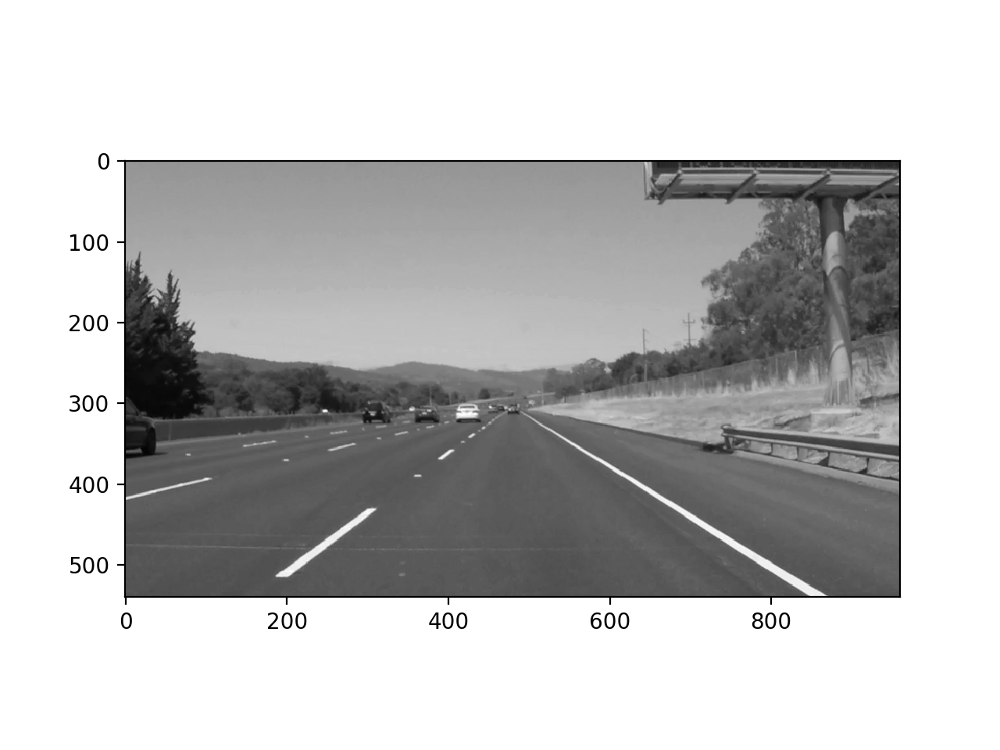
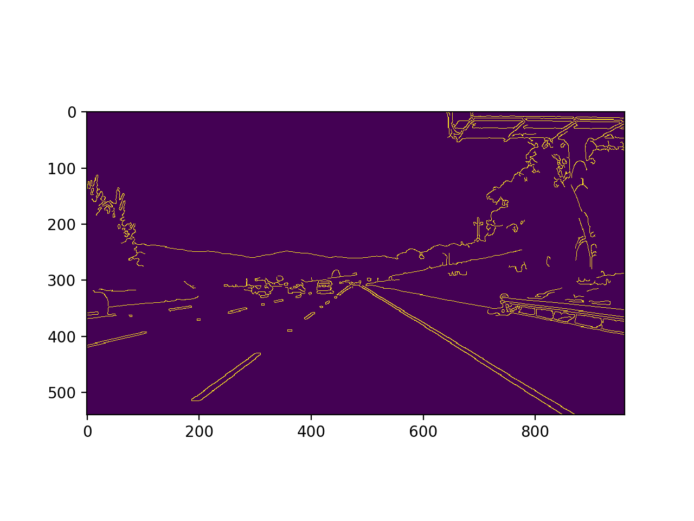
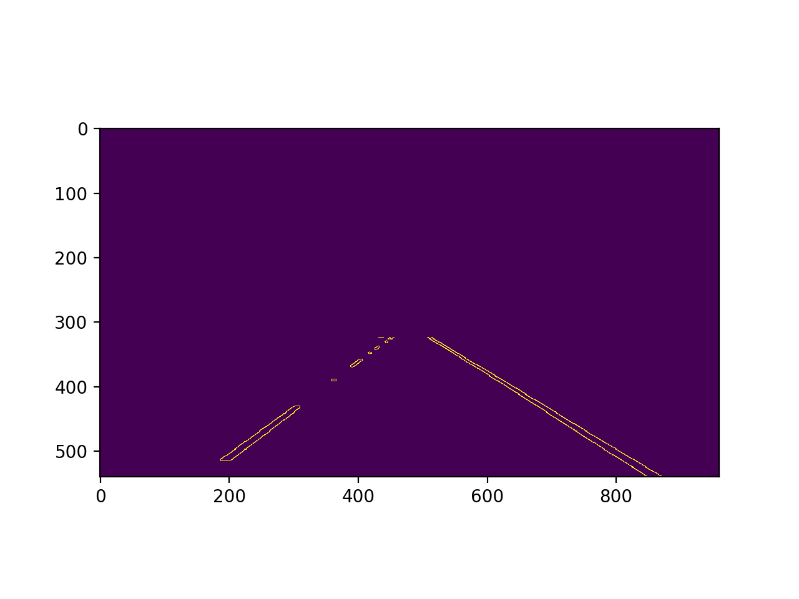
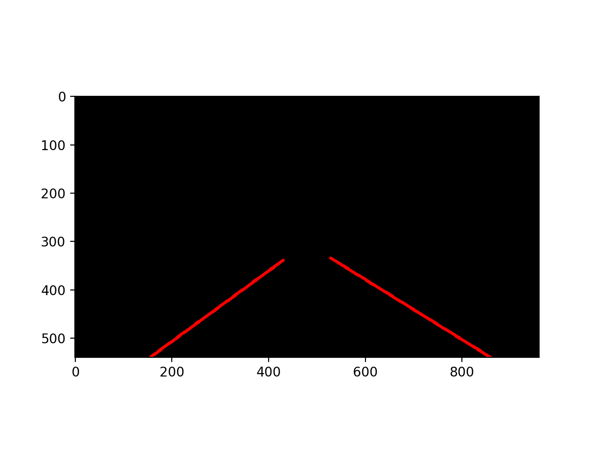
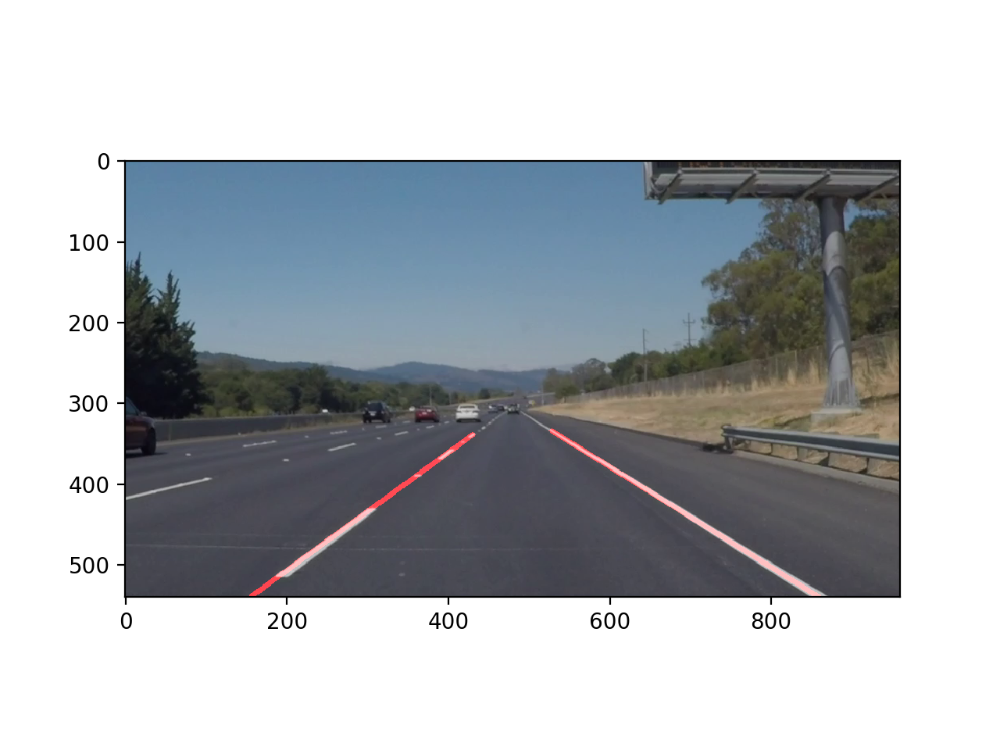

# **Finding Lane Lines on the Road** 

---

**Finding Lane Lines on the Road**

The goals / steps of this project are the following:
* Make a pipeline that finds lane lines on the road
* Reflect on your work in a written report

[//]: # (Image References)

---

### Reflection

### 1. Describe your pipeline. As part of the description, explain how you modified the draw_lines() function.

My pipeline consisted of 5 steps. 

    1. Convert the image to grayscale
    
    
    2. Define a kernel size and apply Gaussian smoothing
    
    3. Run Canny edge-detection on the blurred image, with low and high gradient thresholds
    
    
    4. Mask the region of interest on the canny-edged image. 
    
    
    5. Hough transformation
    

    6. Overlaid the averaged and extrapolated lines on the input image.
    
    
    

### 2. Identify potential shortcomings with your current pipeline

One potential shortcoming would be what would happen when the white or yellow line are covered with snow. 

Another shortcoming could be that if a car with whilte or yellow body cuts in front of my car, the function might not work correctly. 

### 3. Suggest possible improvements to your pipeline

A possible improvement would be to make the function recognize another car and distinguisch the line on the ground.

